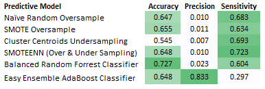

# **Credit Risk Analysis**

## **Overview**
The purpose of this analysis is to leverage financial data on historical credit customers to understand the ability of various Machine Learning models to accurately predict high credit risk. These models will leverage historical data (features) of these consumers and some models will even be able to indicate which feature is most likely to explain variability in the prediction of high credit risk.

## **Results**
An aggregated table below highlights the balanced accuracy scores, precision scores and recall (sensitivity) scores for each of the 6 predictive models that were tested as a part of this analysis.

## **Summary & Recommendation**

The most accurate predictive model was the Balanced Random Forrest Classifier, yet most of the other models were relatively accurate besides the Cluster Centroids Undersampling model.

The most precise predictive model was the Easy Ensemble AdaBoost Classifier with a score far ahead of the other predictive models.

Should minimizing the chance of a high risk customer slipping through an approvals process be the primary concern then I would reccomend the Balanced Random Forrest Classifier for its superior Accuracy and moderate Sensitivity.

But if the precision of the model for both low and high credit risk customers is preferred, then the Easy Ensemble AdaBoost Classifier would be the recommend choice.

Working to improve these models with other relevant features is a step towards constantly improving such a credit risk algorithm. 